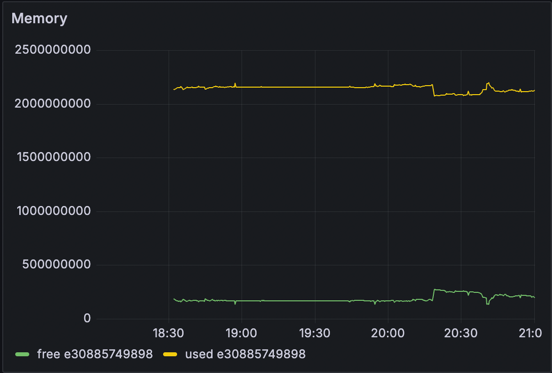

# Resource-Monitoring-Systems

## Load Test Results

During the load test, various system metrics were monitored using Grafana. Below are the screenshots of the dashboards showing the system behavior under load.

### CPU Usage

### Memory Usage

### Disk I/O

### Network Traffic

